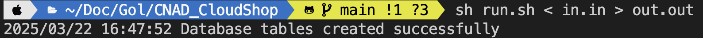

# Cloud Shop

## Requirements
* Go: 1.24.1

## Installation
```bash
cd your/path/to/CNAD_CloudShop
sh build.sh
```

## Usage
> [!NOTE]
> Need to wait for 1~10 seconds to create the database and tables.
> After `Database tables created successfully` message appears, you can start using the application.
> 
```bash
sh run.sh
# sh run.sh < in.in > out.out
```

## Docker Usage
> [!IMPORTANT]
> If above installation or usage is not working, you can use docker to run the application.

### Build Docker Image
```bash
cd your/path/to/CNAD_CloudShop
docker build -t cloud_shop .
```

### Run Docker Container
> [!NOTE]
> Need to wait for 10~30 seconds to create the database and tables.
> After `Database tables created successfully` message appears, you can start using the application.
> ex. `2025/03/22 08:26:48 Database tables created successfully`
> 

* Run the container with interactive mode
    * Need to input data manually
```bash
docker run -it cloud_shop
```

* Run the container with input file
    * Create a file ex.`in.in` with input data, and the output will be saved in `out.out`
```bash
docker run -i cloud_shop < in.in > out.out
```

## Demands
### Task
The task is to develop a solution for the below mentioned problem. You are expected to build a CLI (command line interface) application, which should take input on STDIN and post output on STDOUT (please note error messages are to be directed to STDOUT and not STDERR). There is no need for any other interface (Web, APIs etc). The key focus area will be the design of the solution and the structure of the code. Weightage will be given to clear design, extensibility of code to allow easy addition of features, modularity to ensure clear separation of concerns. Apart from the mentioned test cases, we may manually run a few additional test cases, which are closely related to the ones mentioned.

### Additional notes
Please ensure concepts of extensibility, ease of testing, abstraction and appropriate application of type safety are demonstrated.

## Architecture
```
CNAD_cloudShop/
├── src/
│   ├── domain/                     # Domain models
│   │   ├── user.go
│   │   ├── listing.go
│   │   └── category.go
│   ├── repository/                 # Data access layer, persistence
│   │   ├── repository.go           # Repository interfaces
│   │   ├── sqlite_repository.go    # SQLite implementation
│   │   ├── user_repository.go
│   │   ├── listing_repository.go
│   │   └── category_repository.go
│   ├── service/                    # Business logic layer
│   │   ├── user_service.go
│   │   ├── listing_service.go
│   │   └── category_service.go
│   └── cli/                        # Command line interface
│       ├── cli.go                  # CLI runner and factory
│       ├── command.go              # Command interface
│       ├── register.go
│       ├── create_listing.go
│       ├── delete_listing.go
│       ├── get_listing.go
│       ├── get_category.go
│       └── get_top_category.go
├── resources/                      # Folder will be created at runtime
│   └── db.sqlite                   # SQLite database
├── .env                            # Environment variables
├── build.sh                        # Build script
├── run.sh                          # Run script
├── main.go                         # Entry point
├── go.mod                          # Go module definition
├── go.sum                          # Go module lock file
└── README.md                       # Project documentation
```

## Description
* In this project, I have implemented the project using Golang to finish the speficication.
* The project is divided into four layers: **domain**, **repository**, **service**, and **cli**:

  - **Domain**: Represents the core business entities (e.g., User, Listing, Category) and their basic logic.  
  - **Repository**: Handles persistence, such as SQLite database operations, and defines interfaces for data storage. Implement data access methods for each domain model.
  - **Service**: Contains business logic, orchestrating higher-level operations by combining domain models and repository methods.  
  - **CLI**: User Interface layer, which provides a command-line interface for user interaction. It captures commands (like CREATE_LISTING, GET_CATEGORY, etc.) and delegates processing to the service layer.

* Since the project has some settings and configurations, I have included a **`.env`** file to store environment variables. Currently, it contains the following variable:
    * `START_IDX`: The starting index for the listing ID. Current setting is `100000`.
    * `INPUT_TIME_FORMAT`: Since seconds are not enough to distinguish the time, I have added the date format `2006-01-02 15:04:05.99999999` to the input, which can distinguish the time up to nanoseconds. Default is `2006-01-02 15:04:05`.
    *  `OUTPUT_TIME_FORMAT`: The output time format, after retrieving the listing from the SQLite database, the time string will not be the same as the input format. In order to make sure to fit the assignment requirements, the format is set to `2006-01-02 15:04:05`.

* By keeping these layers separate, new features can be added more easily without breaking existing code, and each layer can be tested independently.